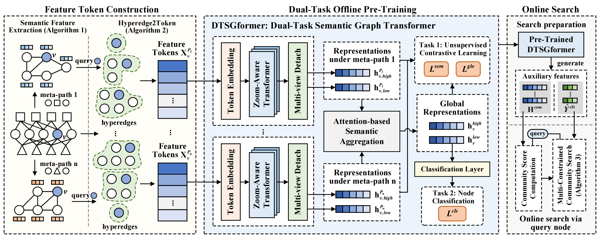

# Introduction

This is the pytorch implementation of paper "Scalable Unsupervised Community Search via Graph Transformer over Attributed Heterogeneous Information Networks"



## Requirements
```
torch                     2.2.0
torch_geometric           2.5.3
torch-scatter             2.1.1
torch-sparse              0.6.17
torchvision               0.17.0
numpy                     1.23.5
pandas                    2.0.3
```

## Dataset
The `dataset` folder contains the preprocessed IMDB data.

## Train
Train and evaluate the model using python file `mainTrain.py`.